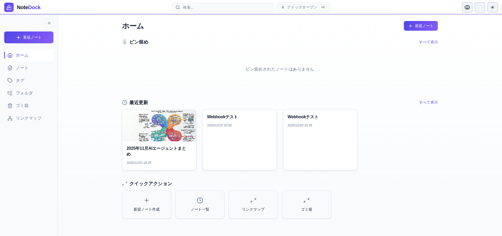
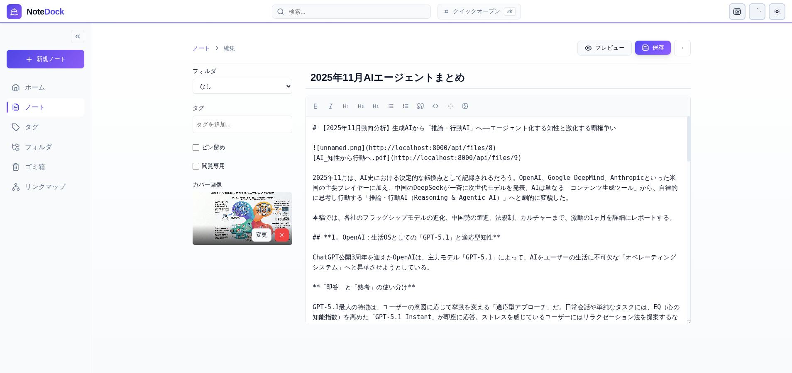
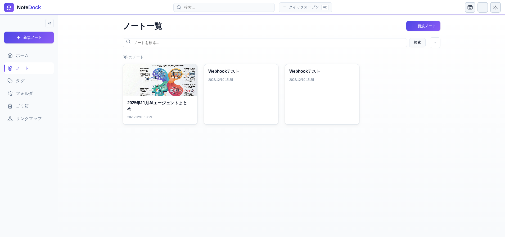
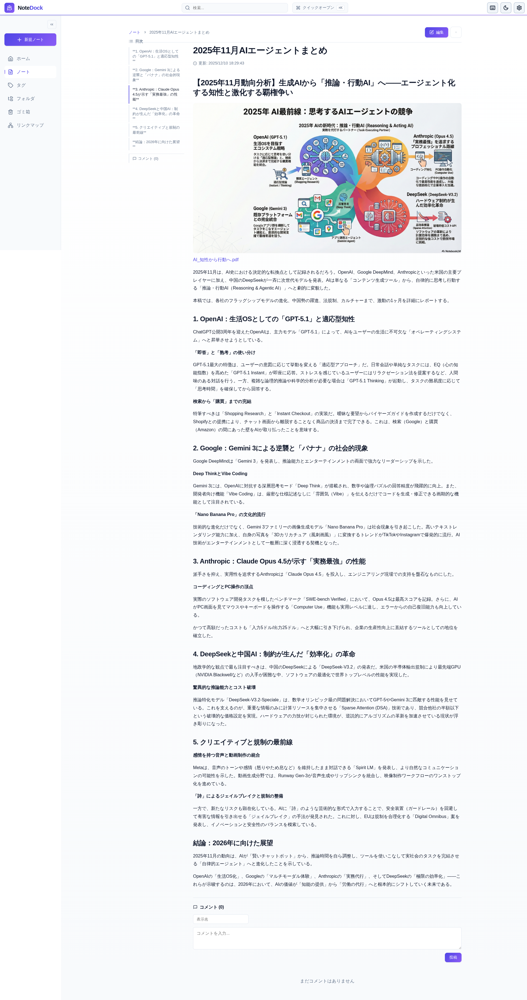
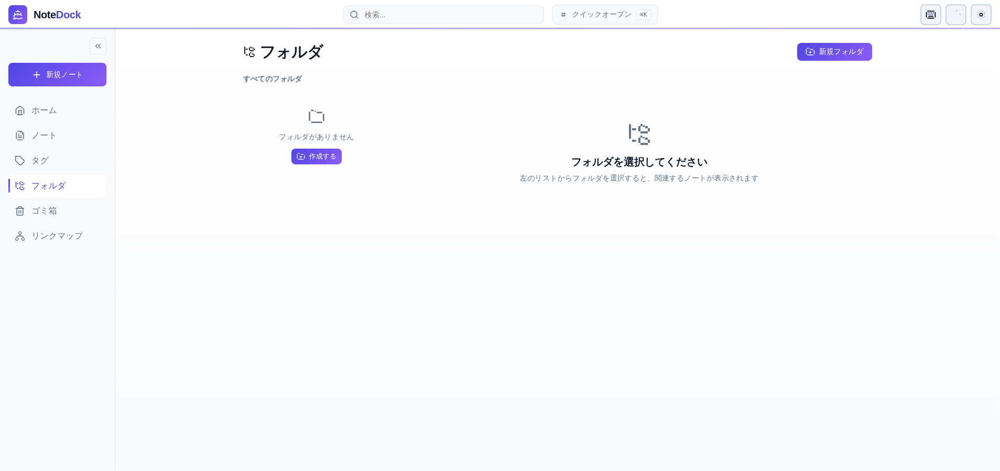
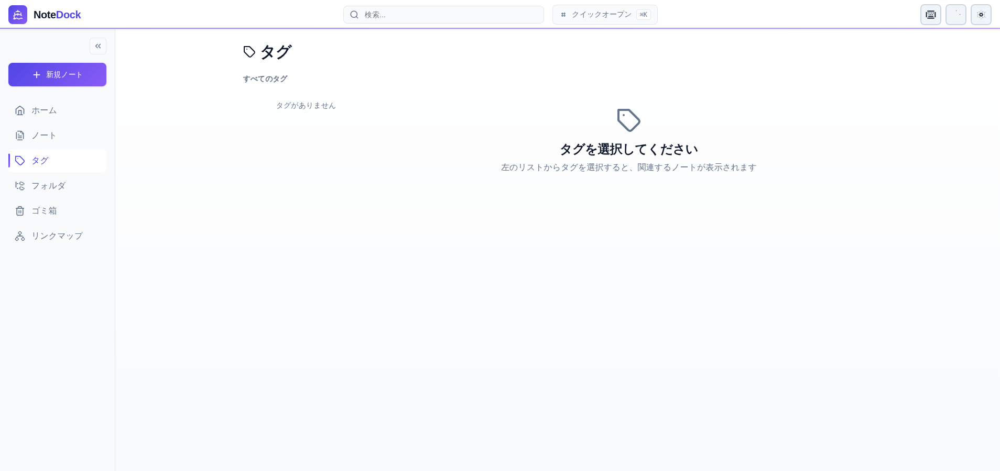
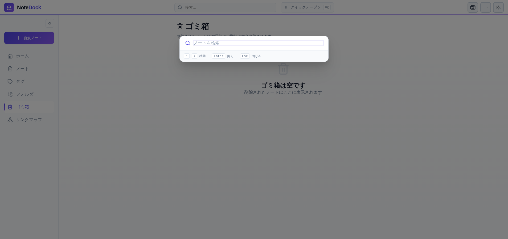
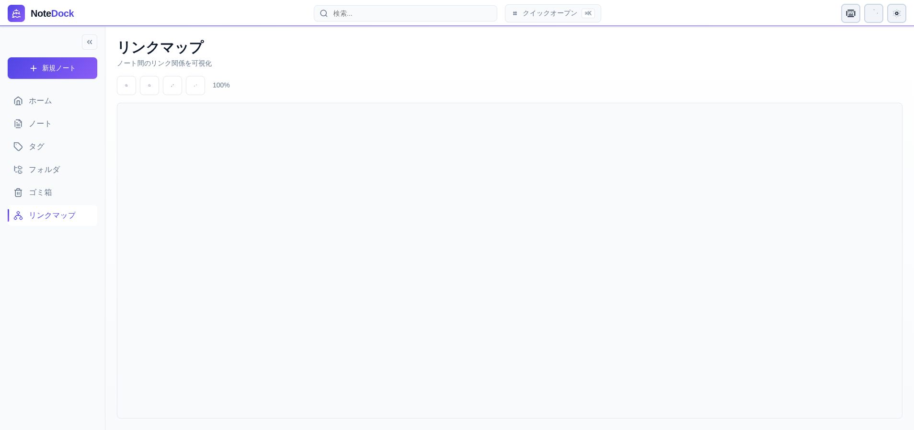
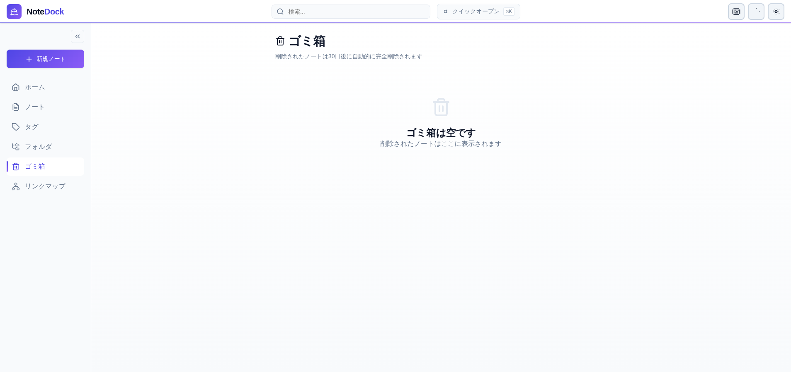
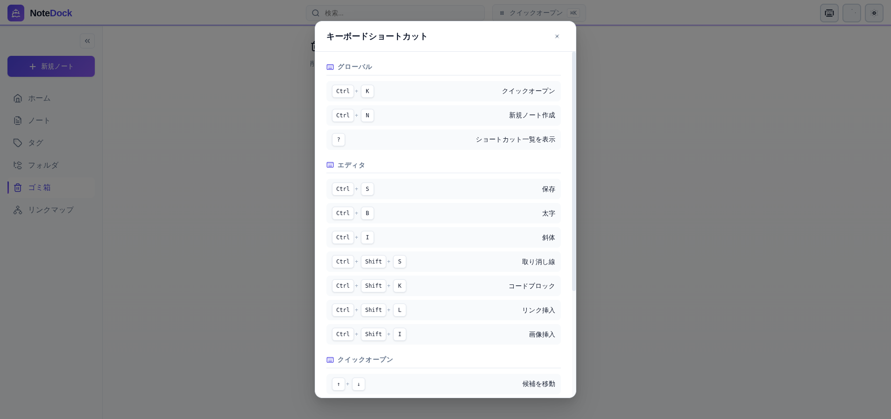

# NoteDock ユーザーガイド

NoteDock は、ITエンジニアチーム向けの Markdown ベースナレッジ管理アプリケーションです。このガイドでは、システムの使い方を画面付きで説明します。

---

## 目次

1. [画面構成](#1-画面構成)
2. [ノートの作成](#2-ノートの作成)
3. [ノートの閲覧・編集](#3-ノートの閲覧編集)
4. [ノートの整理](#4-ノートの整理)
5. [検索・クイックオープン](#5-検索クイックオープン)
6. [リンクマップ](#6-リンクマップ)
7. [ゴミ箱](#7-ゴミ箱)
8. [設定](#8-設定)
9. [便利な機能](#9-便利な機能)
10. [キーボードショートカット](#10-キーボードショートカット)
11. [管理者向け：マイグレーション](#11-管理者向けマイグレーション)

---

## 1. 画面構成

### ホーム画面



ホーム画面は NoteDock のダッシュボードです。以下のセクションで構成されています：

| 番号 | 要素 | 説明 |
|------|------|------|
| 1 | **ヘッダー** | ロゴ、検索バー、クイックオープン、テーマ切替、設定 |
| 2 | **サイドバー** | ナビゲーションメニュー（ホーム、ノート、タグ、フォルダ、ゴミ箱、リンクマップ） |
| 3 | **ピン留め** | ピン留めされた重要なノート |
| 4 | **最近更新** | 最近更新されたノートのカード表示 |
| 5 | **クイックアクション** | よく使う操作へのショートカット |

### サイドバーメニュー

| メニュー | 説明 |
|----------|------|
| **新規ノート** | 新しいノートを作成 |
| **ホーム** | ダッシュボードに戻る |
| **ノート** | ノート一覧を表示 |
| **タグ** | タグ別にノートを整理・閲覧 |
| **フォルダ** | フォルダ別にノートを整理・閲覧 |
| **ゴミ箱** | 削除されたノートを確認・復元 |
| **リンクマップ** | ノート間のリンク関係を可視化 |

---

## 2. ノートの作成

### 手順

1. サイドバーの **「+ 新規ノート」** ボタンをクリック
2. または、ホーム画面の **「新規ノート作成」** をクリック
3. または、キーボードショートカット `Ctrl + N` を使用

### 新規ノート編集画面



新規ノート作成時は、以下の項目を入力できます：

| 項目 | 説明 |
|------|------|
| **タイトル** | ノートのタイトル（必須） |
| **本文** | Markdown 形式で記述 |
| **フォルダ** | 所属フォルダを選択（任意） |
| **タグ** | タグを追加（複数可、任意） |
| **ピン留め** | 重要なノートをホームに固定 |
| **閲覧専用** | 編集を禁止する |
| **カバー画像** | ノートのサムネイル画像 |

### Markdown ツールバー

編集画面上部のツールバーで、以下の書式を簡単に挿入できます：

| アイコン | 機能 | ショートカット |
|----------|------|----------------|
| **B** | 太字 | `Ctrl + B` |
| *I* | 斜体 | `Ctrl + I` |
| H1 | 見出し1 | - |
| H2 | 見出し2 | - |
| H3 | 見出し3 | - |
| リスト | 箇条書き | - |
| 番号 | 番号付きリスト | - |
| 引用 | 引用ブロック | - |
| コード | コードブロック | `Ctrl + Shift + K` |
| リンク | リンク挿入 | `Ctrl + Shift + L` |
| 画像 | 画像挿入 | `Ctrl + Shift + I` |

### ノート間リンクの挿入

本文中で `[#` と入力すると、既存ノートの候補が表示されます。選択すると `#1` のような内部リンクが挿入され、クリックで該当ノートに移動できます。

---

## 3. ノートの閲覧・編集

### ノート一覧画面



- カバー画像付きのカード形式で表示
- 検索ボックスでタイトル・本文を検索
- ノートカードをクリックして詳細を表示

### ノート詳細画面



詳細画面では以下の機能が利用できます：

| 要素 | 説明 |
|------|------|
| **目次（左サイド）** | h2 見出し（##）の一覧。クリックでジャンプ |
| **本文** | Markdown がレンダリングされた表示 |
| **コメント** | ノートへのコメント投稿・閲覧 |
| **編集ボタン** | 編集画面に移動 |
| **メニュー** | 複製、削除、バージョン履歴などの操作 |

### バージョン履歴

ノートは保存時に自動でバージョン履歴が作成されます。詳細画面のメニューから「バージョン履歴」を選択すると、過去のバージョンを閲覧・復元できます。

---

## 4. ノートの整理

### フォルダ管理



フォルダを使ってノートを階層的に整理できます（最大3階層）。

**フォルダの作成手順：**
1. サイドバーの **「フォルダ」** をクリック
2. **「+ 新規フォルダ」** ボタンをクリック
3. フォルダ名を入力して保存

**ノートをフォルダに移動：**
1. ノート編集画面を開く
2. 左側の「フォルダ」ドロップダウンから選択

### タグ管理



タグを使ってノートを横断的に分類できます。

**タグの追加手順：**
1. ノート編集画面を開く
2. 「タグを追加...」欄にタグ名を入力
3. Enter で追加（既存タグはサジェスト表示）

**タグでフィルタリング：**
1. サイドバーの **「タグ」** をクリック
2. 左側のタグ一覧から選択
3. 該当ノートが右側に表示

---

## 5. 検索・クイックオープン

### 通常検索

ヘッダーの検索バーに入力すると、ノートのタイトル・本文・タグを検索できます。

### クイックオープン



`Ctrl + K` でクイックオープンを起動すると、インクリメンタル検索でノートを素早く開けます。

**操作方法：**
| キー | 動作 |
|------|------|
| `↑` `↓` | 候補を移動 |
| `Enter` | 選択したノートを開く |
| `Esc` | 閉じる |

---

## 6. リンクマップ



ノート間のリンク関係をグラフで可視化します。

**機能：**
- ノード（丸）がノートを表す
- 矢印がリンク関係を表す
- ノードをクリックすると該当ノートに移動
- ホバーでノートのプレビューを表示

**操作：**
| ボタン | 動作 |
|--------|------|
| ズームイン | 拡大表示 |
| ズームアウト | 縮小表示 |
| リセット | 初期表示に戻す |
| 更新 | データを再取得 |

---

## 7. ゴミ箱



削除されたノートは一時的にゴミ箱に移動します。

**特徴：**
- 削除後 30 日間は復元可能
- 30 日経過すると自動的に完全削除
- ゴミ箱から「復元」で元に戻す
- 「完全削除」で即座に削除

---

## 8. 設定

サイドバーの **「設定」** から各種設定を行えます。

### ユーザー設定

#### 表示名

ノートの作成・更新時に記録される名前を設定します。

**重要：** 表示名を設定しないと、ノートの編集やコメント投稿ができません。

**設定手順：**

1. サイドバーの **「設定」** をクリック
2. **「表示名」** 欄に名前を入力
3. **「保存」** ボタンをクリック

設定した表示名は以下の場所で表示されます：

- ノート詳細画面の「作成者」「更新者」
- コメントの投稿者名

### 通知設定

#### Discord 通知

ノートの作成・更新、コメント投稿時に Discord へ通知を送信できます。

**前提条件：**

- 環境変数 `DISCORD_WEBHOOK_URL` が設定されていること

**設定手順：**

1. サイドバーの **「設定」** をクリック
2. **「Discord通知」** のトグルボタンをクリック
3. 有効/無効が切り替わります

| 状態 | 説明 |
|------|------|
| **有効** | ノート作成・更新・コメント投稿時に Discord へ通知 |
| **無効** | 通知を送信しない（デフォルト） |

### AI設定

#### 使用モデル

AI機能（要約、質問応答など）で使用するモデルを選択できます。

**設定手順：**

1. サイドバーの **「設定」** をクリック
2. **「AI設定」** セクションの **「使用モデル」** ドロップダウンから選択
3. 選択するとすぐに設定が保存されます

**利用可能なモデル：**

モデルは応答速度によって3つのカテゴリに分類されています：

| カテゴリ | アイコン | 説明 |
|----------|----------|------|
| **高速** | ⚡ | 2秒未満で応答。日常的な使用に最適 |
| **標準** | 🔶 | 2〜5秒で応答。バランスの取れた選択 |
| **低速** | 🐢 | 5秒以上かかる場合あり。高度な推論向け |

**主な対応モデル：**

- **OpenAI**: GPT-4o, GPT-4.1, GPT-5系, o3/o4-mini系
- **Anthropic**: Claude 4 Sonnet, Claude Sonnet 4.5
- **Google**: Gemini 2.0 Flash, Gemini 2.5 Flash

---

## 9. 便利な機能

### テーマ切替

ヘッダー右上のテーマ切替ボタンで、ライトモード/ダークモードを切り替えられます。設定はブラウザに保存されます。

### 添付ファイル

ノートには以下のファイルを添付できます：
- 画像（PNG, JPG, GIF, WebP）
- PDF
- PowerPoint（PPT, PPTX）
- テキスト（TXT, MD）

**アップロード方法：**
1. 編集画面でドラッグ＆ドロップ
2. または「画像」ボタンからファイル選択

### ノート間リンク

本文中に `#1` のように記述すると、ID=1 のノートへのリンクになります。リンクにホバーするとプレビューが表示されます。

### コメント機能

ノート詳細画面の下部でコメントを投稿できます。スレッド形式で議論が可能です。

### テンプレート

よく使うノート形式をテンプレートとして保存し、新規ノート作成時に適用できます。

### インポート/エクスポート

- **エクスポート**: ノートを ZIP 形式でダウンロード
- **インポート**: ZIP ファイルからノートを一括登録

---

## 10. キーボードショートカット



`?` キーでショートカット一覧を表示できます。

### グローバル

| ショートカット | 動作 |
|----------------|------|
| `Ctrl + K` | クイックオープン |
| `Ctrl + N` | 新規ノート作成 |
| `?` | ショートカット一覧を表示 |

### エディタ

| ショートカット | 動作 |
|----------------|------|
| `Ctrl + S` | 保存 |
| `Ctrl + B` | 太字 |
| `Ctrl + I` | 斜体 |
| `Ctrl + Shift + S` | 取り消し線 |
| `Ctrl + Shift + K` | コードブロック |
| `Ctrl + Shift + L` | リンク挿入 |
| `Ctrl + Shift + I` | 画像挿入 |

### ノート一覧

| ショートカット | 動作 |
|----------------|------|
| `J` | 次のノートへ |
| `K` | 前のノートへ |
| `Enter` | ノートを開く |

---

## 11. 管理者向け：マイグレーション

NoteDock v2 へのアップグレード時に使用するマイグレーションスクリプトについて説明します。

### 概要

`scripts/migrate_to_v2.sh` は、v1 から v2 へのデータ移行を安全に行うためのスクリプトです。

**主な機能：**

- データベースの自動バックアップ
- Alembic マイグレーションの実行
- Discord 通知設定の初期化
- 既存ノートへのデフォルト作成者の設定（オプション）

### 前提条件

- PostgreSQL クライアント（`pg_dump`, `psql`）がインストールされていること
- Python 仮想環境と Alembic がインストールされていること
- `backend/.env` または環境変数でデータベース接続情報が設定されていること

### 使用方法

#### 基本実行（推奨）

```bash
./scripts/migrate_to_v2.sh
```

以下の処理が順番に実行されます：

1. データベースのバックアップ（`backups/` ディレクトリに保存）
2. Alembic マイグレーションの実行
3. Discord 通知設定の初期化（デフォルト：無効）

#### 既存ノートに作成者を設定

v2 では、ノートの作成者・更新者が記録されます。既存のノートにデフォルトの作成者を一括設定できます：

```bash
./scripts/migrate_to_v2.sh --set-author "管理者"
```

#### ヘルプ表示

```bash
./scripts/migrate_to_v2.sh --help
```

### 実行例

```text
========================================
  NoteDock v2 マイグレーションスクリプト
========================================

[INFO] .env ファイルを読み込み中...
[INFO] データベース: notedock @ localhost:5432

マイグレーションを開始しますか？ (y/N): y

----------------------------------------
Step 1: データベースバックアップ
----------------------------------------
[INFO] バックアップディレクトリを作成: /path/to/backups
[INFO] データベースをバックアップ中...
[SUCCESS] バックアップ完了: backups/notedock_backup_20250611_120000.sql

----------------------------------------
Step 2: Alembicマイグレーション
----------------------------------------
[INFO] 現在のデータベースリビジョン:
abc123 (head)
[INFO] マイグレーションを適用中...
[SUCCESS] マイグレーション完了

----------------------------------------
Step 3: 設定初期化
----------------------------------------
[SUCCESS] Discord通知設定を初期化しました（デフォルト: 無効）

========================================
  マイグレーション完了
========================================
```

### バックアップからの復元

マイグレーションに問題が発生した場合、バックアップから復元できます：

```bash
PGPASSWORD="your_password" psql \
  -h localhost \
  -p 5432 \
  -U postgres \
  -d notedock \
  < backups/notedock_backup_YYYYMMDD_HHMMSS.sql
```

### v2 の新機能

マイグレーション後、以下の機能が利用可能になります：

| 機能 | 説明 |
|------|------|
| **表示名設定** | ユーザーごとの表示名を設定し、ノートの作成者・更新者として記録 |
| **作成者・更新者表示** | ノート詳細画面で誰が作成・更新したかを確認可能 |
| **Discord 通知切替** | UI から Discord 通知の有効/無効を切り替え可能 |
| **設定画面** | サイドバーから設定画面にアクセス可能 |

---

## アクセス情報

- **フロントエンド**: http://localhost:3000
- **API ドキュメント**: http://localhost:8000/api/docs

---

## トラブルシューティング

### ノートが保存できない

1. ネットワーク接続を確認
2. ブラウザを再読み込み
3. 開発者ツールでエラーを確認

### 画像がアップロードできない

1. ファイルサイズを確認
2. 対応形式（PNG, JPG, GIF, WebP）か確認
3. MinIO サービスが起動しているか確認

### 検索結果が表示されない

1. 検索キーワードを確認
2. バックエンドサービスが起動しているか確認

---

*このガイドは NoteDock の基本的な使い方を説明しています。詳細な仕様については [システム仕様書](spec.md) を参照してください。*
